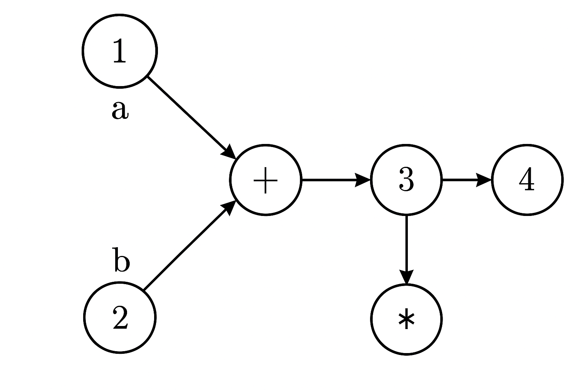

# Even Derch Project

A distributed system simulation using agent-based graphs — an advanced practice in algorithmics, concurrency, and modular software design.

## Project Overview

This project simulates a distributed system composed of multiple agents operating on a message-passing topic graph. Each agent performs mathematical operations (such as addition or multiplication) by receiving input from topics and sending results to other topics.

The architecture mimics a decentralized computation environment where each node acts independently while interacting with others to complete a larger computation task.





## Project Structure

```
Even_Derch_project/
├── src/
│   ├── config/   # Graph setup, agent configuration
│   ├── graph/    # Core logic: agents, topics, messages
│   ├── server/   # HTTP server for running simulations
├── test/         # Unit tests
├── .gitignore
└── README.md     # You are here
```
## Design Patterns Used

This project makes use of several software design patterns:

- **Strategy Pattern**: The `BinOpAgent` class uses a `BinaryOperator<Double>` to allow interchangeable operations (such as addition or multiplication), demonstrating behavioral flexibility at runtime.
  
- **Singleton Pattern**: The `TopicManagerSingleton` ensures a single shared instance for managing topics across agents.

- **Factory (via Reflection)**: In `GenericConfig`, agent classes are instantiated dynamically using reflection, enabling configurable and modular agent creation.

- **Template Method Pattern**: The `Config` interface defines a structure for configuration classes, and `GenericConfig` provides a concrete implementation, customizing the steps of configuration creation and termination.


## How to Run

1. Make sure Java 11 or higher is installed.
2. Open the project in IntelliJ or any compatible Java IDE.
3. Run the main class:
   - `src/config/MainTrain.java` — to configure and run a graph simulation
   - `src/server/MainTrain.java` — to launch the HTTP server

## Example

The system builds a graph where each node is an agent that performs an operation (e.g., multiplication, addition). Agents receive inputs from topics, perform computation, and publish results.

```java
Node n1 = new Node("a", new PlusAgent());
Node n2 = new Node("b", new BinOpAgent("*"));
